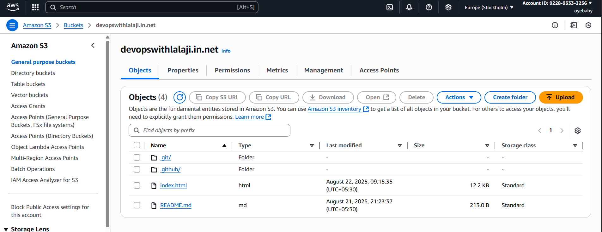
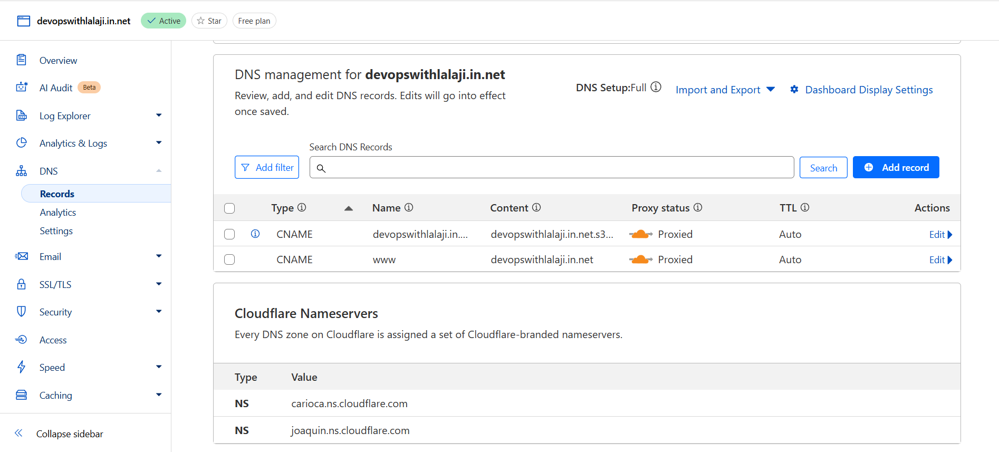
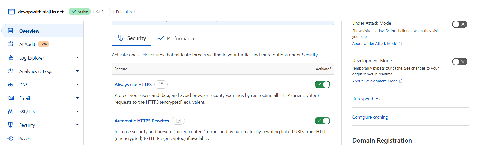
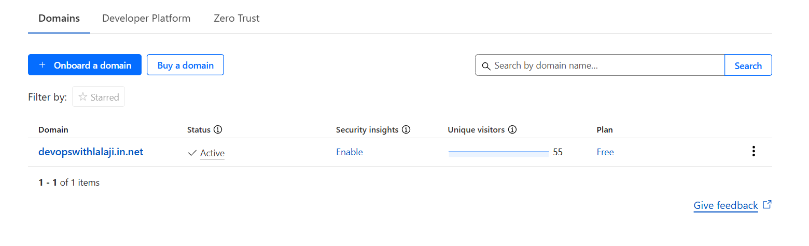
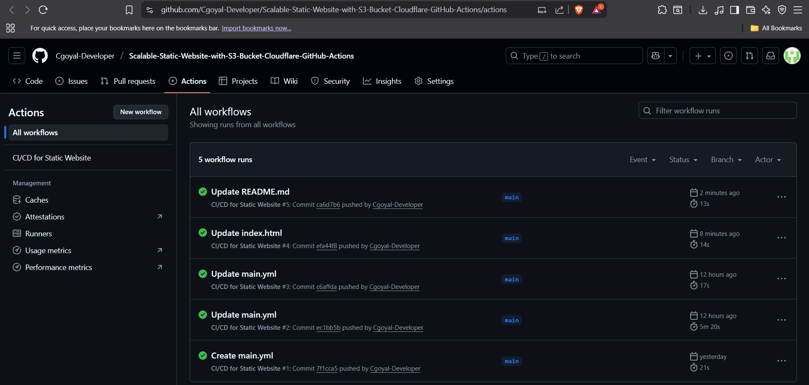
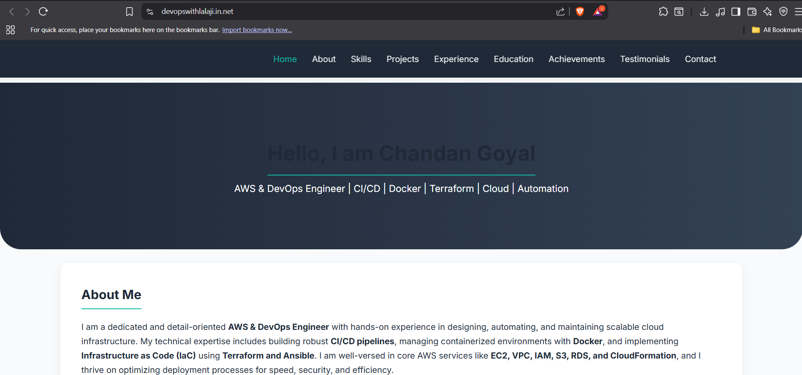
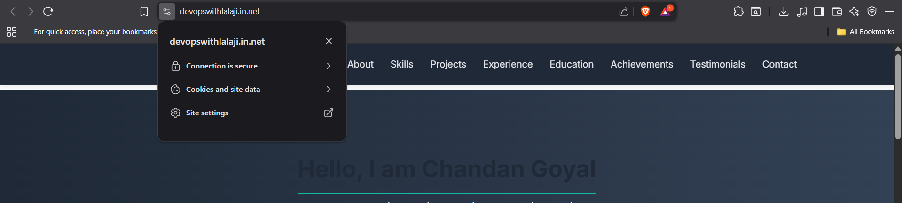

# 🌐 Scalable Static Website with AWS S3 + Cloudflare + GitHub Actions

This project showcases how to deploy and manage a static website using **AWS S3**, **Cloudflare**, and **GitHub Actions**, creating a scalable, secure, and globally distributed web presence with auto-deployment.

---

## 🧰 Tools & Services Used

- **AWS S3** – For static website hosting (Free Tier)
- **Cloudflare** – For DNS, CDN, and SSL (Free Tier)
- **GitHub** – For source control
- **GitHub Actions** – To automate deployment
- **HTML/CSS** – For frontend content
- **Bash** – For deployment scripting within GitHub Actions

---

## 🚀 Deployment Steps

1. **Build a Static Website**  
   - Create and test a simple HTML/CSS-based static site locally.

2. **Host Source on GitHub**  
   - Push your static site code to a GitHub repository (e.g., on the `main` branch).

3. **Set Up AWS S3**  
   - Create a bucket and enable static website hosting.
   - Upload your files and set the correct permissions.
                         OR 
   - Go to AWS Console → S3 → Create bucket
   - Bucket name: yourdomain.com (must be globally unique)
   - Region: Choose your preferred region (e.g., us-east-1)
   - Uncheck “Block all public access” (needed for public website)
   - Create the bucket
  
  ⚙️ Set Bucket Policy for Public Read Access
   - Go to Permissions → Bucket Policy, Edit.
   - Replace yourdomain.com with your bucket name.

  🌐 Enable Static Website Hosting
   - Go to Properties → Static website hosting
   - Enable it
   - Set:
      - Index document: index.html
      - (Optional) Error document: 404.html
      - Save — you will get a Website endpoint URL

4. **Automate with GitHub Actions**  
   - Configure CI/CD to deploy files to S3 on every push.

5. **Connect to Cloudflare**  
   - Add your domain to Cloudflare and point DNS records to your S3 endpoint.
   - Update nameservers on your domain registrar.
                     OR
   🌐 Login & Add Site
    - Sign up / log in to Cloudflare
    - Click Add a Site
    - Enter your domain (e.g., devopswithlalji.in.net)
    - Choose the Free Plan

    📋 Copy Cloudflare Nameservers
     - Cloudflare will provide two nameservers (e.g., ella.ns.cloudflare.com, marty.ns.cloudflare.com)

    🔁 Update Nameservers in Domain Registrar
     - Go to your domain registrar (e.g., GoDaddy, Namecheap, Bigrock)
     - Find DNS / Nameserver settings
     - Replace existing nameservers with the ones provided by Cloudflare
     - Save and wait for propagation (can take a few minutes to hours)

    🔁 Add DNS Record for S3
     - Once Cloudflare activates your domain:
     - Go to DNS tab in Cloudflare
     - Add a new DNS record:
     - Type: CNAME
     - Name: @/devopswithlalji.in.net (for root)
     - Target: devopswithlalji.in.net.s3-website-us-east-1.amazonaws.com
     - Proxy status: Enabled (orange cloud)
     - Add Secont new DNS Record:
     - Type: CNAME
     - Name: www
     - Target: devopswithlalji.in.net
     - Proxy status: Enabled (orange cloud)

6. **Enable HTTPS & Performance**  
   - Activate SSL/TLS in Cloudflare.
   - Enable cache rules and other performance enhancements.
                         OR
   - Go to SSL/TLS → Overview
   - Set SSL mode to Flexible or Full
   - Go to Edge Certificates
   - Enable “Always Use HTTPS”
   - Enable “Auto Minify” (optional)
   - Enable Brotli compression (optional)

---

## 🌐 Cloudflare + S3 Integration

- Domain is registered and connected to Cloudflare.
- S3 serves static content publicly.
- DNS records point to the correct AWS S3 endpoint.
- SSL is enabled via Cloudflare, providing secure HTTPS access.
- Site is delivered through Cloudflare's global CDN with caching and protection.

---

## 🧪 Optional Enhancements

- **S3 Versioning** to allow rollbacks
- **Cache-Control headers** for better performance
- **Custom error pages**

---

## ✅ Deliverables

- ✔️ CI/CD Workflow via GitHub Actions
- ✔️ AWS S3 static hosting
- ✔️ Custom domain connected through Cloudflare
- ✔️ Secure HTTPS delivery
- ✔️ Global CDN via Cloudflare
- ✔️ Screenshots & deployment report
- ✔️ Live working website

---

## 🖼️ Screenshots

| #  | Description                                | Screenshot File Name                |
|----|--------------------------------------------|-------------------------------------|
| 1  | AWS S3 bucket showing uploaded files       | `s3-bucket-interface.png`           |
| 2  | Cloudflare DNS records + nameservers       | `cloudflare-dns-and-nameservers.png`|
| 3  | HTTPS enabled in Cloudflare                | `cloudflare-https-settings.png`     |
| 4  | Domain is active and enabled               | `cloudflare-domain-active.png`      |
| 5  | GitHub Actions deployment log              | `github-actions-workflow.png`       |
| 6  | Browser showing SSL padlock on live site   | `ssl-https-browser-view.png`        |

📁 All screenshots are stored in the `/screenshots/` directory in this repository.

---
## 🖼️ Screenshots

1. **AWS S3 Bucket Interface (Files + Folders)**  
   

2. **Cloudflare DNS Records + Nameservers**  
   

3. **Cloudflare HTTPS Configuration**  
   

4. **Domain Active + Enabled (Cloudflare)**  
   

5. **GitHub Actions Workflow Output**  
   

6. **Browser Showing Live Site**  
   

7. **Browser Showing HTTPS SSL Padlock on Live Site**  
   

---

## 🌍 Live Demo

**Website URL**: [https://devopswithlalaji.in.net](https://devopswithlalaji.in.net)  
> (Replace this with your actual domain after deployment)

---

## 📊 Deployment Report

- Site code is hosted and versioned on GitHub.
- On push, GitHub Actions automatically deploys to S3.
- S3 serves the content publicly with correct permissions.
- Cloudflare is configured to route traffic and handle HTTPS.
- Domain is fully connected and active.
- Browser displays secure HTTPS padlock.

---

## 🔐 Notes

- AWS credentials are securely stored as GitHub Secrets.
- Never hardcode secrets in code.
- Always test deployment manually after setup.
- Use `.gitignore` to keep sensitive or build files out of version control.

---

## 📄 License

MIT License

---

> Author: [Chandan Goyal]  
> GitHub: [https://github.com/Cgoyal-Developer](https://github.com/Cgoyal-Developer)
